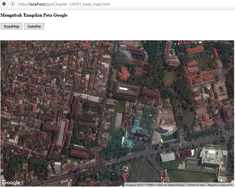

# Sistem-Informasi-Geografi-2017
Catatan kuliah semester GENAP 2016/2017

## ROADMAP

## SATELIT

## Contoh Kode lihat di ling di bawah

[CONTOH KODE GOOGLE MAP](https://github.com/handaga/sistim-informasi-geografi)

## TUGAS-01:

Belajar JAVASCRIPT:

1. Buatlah daftar TYPE DATA
2. Daftar nama fungsi dan kelompoknya
3. Bagaimana cara membuat sebuah fungsi dalam javascript

Tip: lihat link berikut

a. https://www.w3schools.com/js/default.asp

b. http://www.tutorialspoint.com

